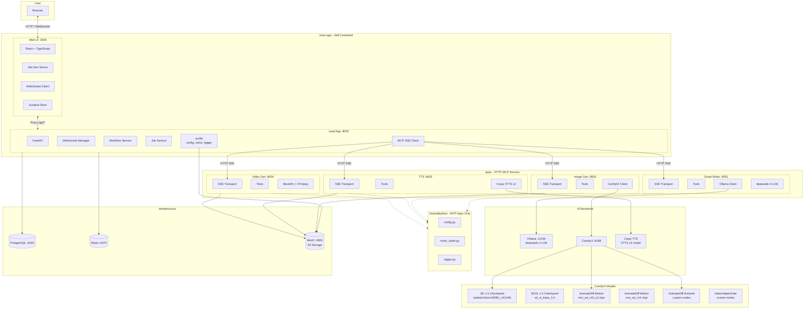
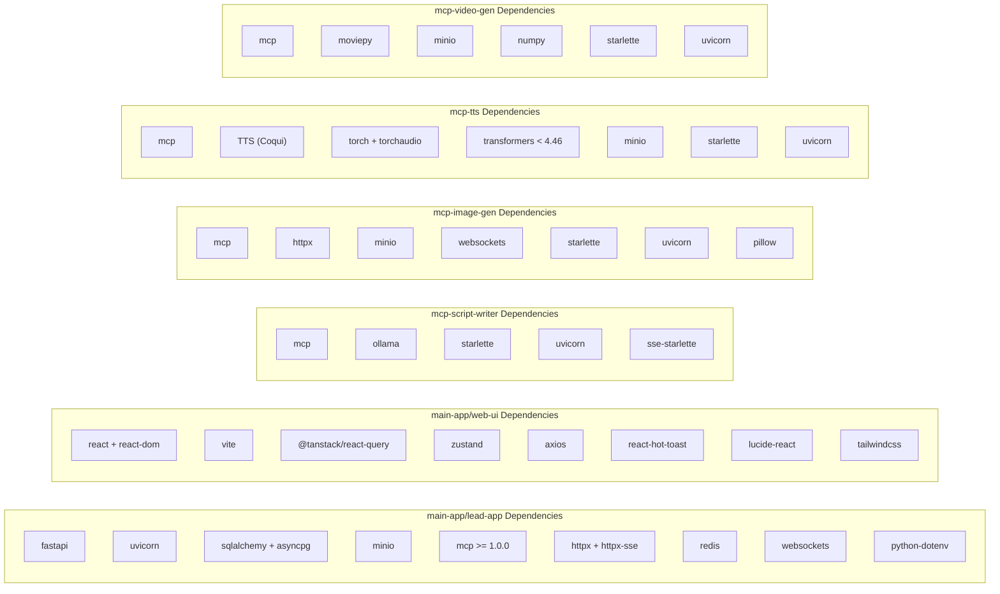
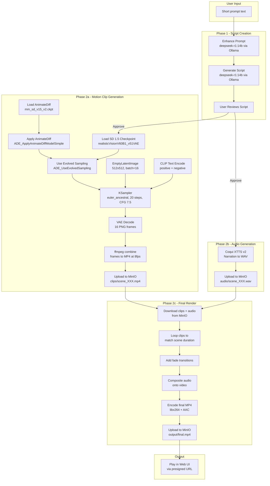
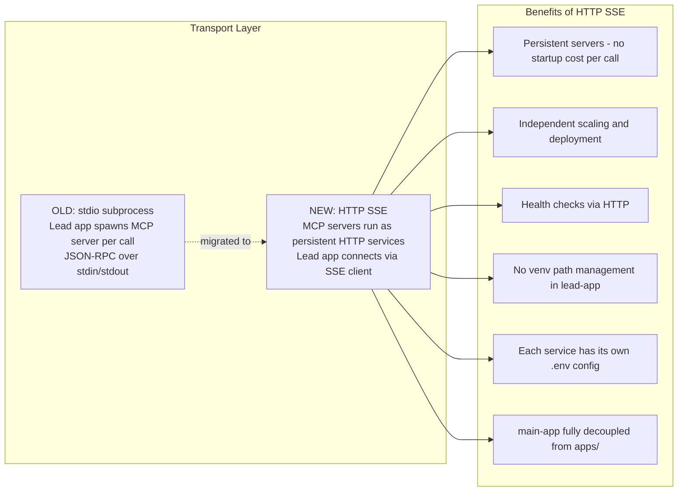
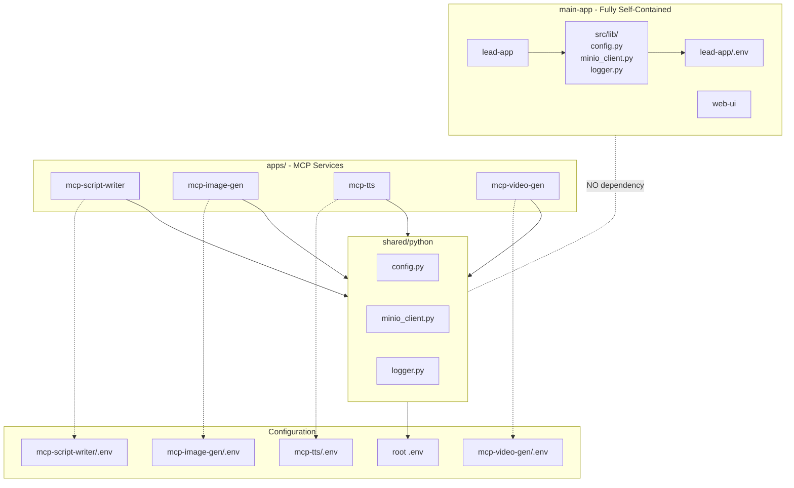

# Architecture Diagram

## Full System Architecture

```mermaid
graph TB
    subgraph USER [User]
        BROWSER["Browser"]
    end

    subgraph MAIN_APP [main-app - Self Contained]
        subgraph WEB_UI [Web UI :3000]
            REACT["React + TypeScript"]
            VITE["Vite Dev Server"]
            WS_CLIENT["WebSocket Client"]
            ZUSTAND["Zustand Store"]
        end

        subgraph LEAD_APP [Lead App :8000]
            FASTAPI["FastAPI"]
            WS_SERVER["WebSocket Manager"]
            WORKFLOW["Workflow Service"]
            JOB_SVC["Job Service"]
            MCP_CLIENT["MCP SSE Client"]
            LIB["src/lib<br/>config, minio, logger"]
        end
    end

    subgraph MCP_SERVERS [apps - HTTP MCP Servers]
        subgraph SCRIPT_WRITER [Script Writer :9001]
            SW_SSE["SSE Transport"]
            SW_TOOLS["Tools"]
            SW_LLM["Ollama Client"]
            SW_MODEL["deepseek-r1:14b"]
        end

        subgraph IMAGE_GEN [Image Gen :9002]
            IG_SSE["SSE Transport"]
            IG_TOOLS["Tools"]
            IG_COMFY["ComfyUI Client"]
        end

        subgraph TTS_SVC [TTS :9003]
            TTS_SSE["SSE Transport"]
            TTS_TOOLS["Tools"]
            TTS_ENGINE["Coqui XTTS v2"]
        end

        subgraph VIDEO_GEN [Video Gen :9004]
            VG_SSE["SSE Transport"]
            VG_TOOLS["Tools"]
            VG_MOVIEPY["MoviePy + FFmpeg"]
        end
    end

    subgraph SHARED_LIB [shared/python - MCP Apps Only]
        S_CONFIG["config.py"]
        S_MINIO["minio_client.py"]
        S_LOGGER["logger.py"]
    end

    subgraph AI_BACKENDS [AI Backends]
        OLLAMA["Ollama :11434<br/>deepseek-r1:14b"]
        COMFYUI["ComfyUI :8188"]
        COQUI["Coqui TTS<br/>XTTS v2 model"]
    end

    subgraph COMFY_MODELS [ComfyUI Models]
        SD15["SD 1.5 Checkpoint<br/>realisticVisionV60B1_v51VAE"]
        SDXL["SDXL 1.0 Checkpoint<br/>sd_xl_base_1.0"]
        MM_V2["AnimateDiff Motion<br/>mm_sd_v15_v2.ckpt"]
        MM_V14["AnimateDiff Motion<br/>mm_sd_v14.ckpt"]
        ADE_NODES["AnimateDiff-Evolved<br/>custom nodes"]
        VHS_NODES["VideoHelperSuite<br/>custom nodes"]
    end

    subgraph INFRA [Infrastructure]
        PG[("PostgreSQL :5432")]
        REDIS[("Redis :6379")]
        MINIO[("MinIO :9000<br/>S3 Storage")]
    end

    BROWSER <-->|"HTTP / WebSocket"| WEB_UI
    WEB_UI <-->|"Proxy /api/*"| LEAD_APP

    MCP_CLIENT -->|"HTTP SSE"| SW_SSE
    MCP_CLIENT -->|"HTTP SSE"| IG_SSE
    MCP_CLIENT -->|"HTTP SSE"| TTS_SSE
    MCP_CLIENT -->|"HTTP SSE"| VG_SSE

    SW_LLM --> OLLAMA
    IG_COMFY --> COMFYUI
    TTS_ENGINE --> COQUI

    COMFYUI --> SD15
    COMFYUI --> MM_V2
    COMFYUI --> ADE_NODES

    SCRIPT_WRITER -.-> SHARED_LIB
    IMAGE_GEN -.-> SHARED_LIB
    TTS_SVC -.-> SHARED_LIB
    VIDEO_GEN -.-> SHARED_LIB

    LEAD_APP --> PG
    LEAD_APP --> REDIS
    LIB --> MINIO

    IMAGE_GEN --> MINIO
    TTS_SVC --> MINIO
    VIDEO_GEN --> MINIO
```

---

## Dependency Map

```mermaid
graph LR
    subgraph main_app_deps [main-app/lead-app Dependencies]
        LA_FASTAPI["fastapi"]
        LA_UVICORN["uvicorn"]
        LA_SQLA["sqlalchemy + asyncpg"]
        LA_MINIO["minio"]
        LA_MCP["mcp >= 1.0.0"]
        LA_HTTPX["httpx + httpx-sse"]
        LA_REDIS["redis"]
        LA_WS["websockets"]
        LA_DOTENV["python-dotenv"]
    end

    subgraph web_ui_deps [main-app/web-ui Dependencies]
        WU_REACT["react + react-dom"]
        WU_VITE["vite"]
        WU_RQ["@tanstack/react-query"]
        WU_ZUSTAND["zustand"]
        WU_AXIOS["axios"]
        WU_TOAST["react-hot-toast"]
        WU_LUCIDE["lucide-react"]
        WU_TW["tailwindcss"]
    end

    subgraph script_writer_deps [mcp-script-writer Dependencies]
        SW_MCP["mcp"]
        SW_OLLAMA["ollama"]
        SW_STARLETTE["starlette"]
        SW_UVICORN["uvicorn"]
        SW_SSE_STAR["sse-starlette"]
    end

    subgraph image_gen_deps [mcp-image-gen Dependencies]
        IG_MCP["mcp"]
        IG_HTTPX["httpx"]
        IG_MINIO["minio"]
        IG_WS["websockets"]
        IG_STARLETTE["starlette"]
        IG_UVICORN["uvicorn"]
        IG_PILLOW["pillow"]
    end

    subgraph tts_deps [mcp-tts Dependencies]
        TTS_MCP["mcp"]
        TTS_LIB["TTS (Coqui)"]
        TTS_TORCH["torch + torchaudio"]
        TTS_TRANS["transformers < 4.46"]
        TTS_MINIO["minio"]
        TTS_STARLETTE["starlette"]
        TTS_UVICORN["uvicorn"]
    end

    subgraph video_gen_deps [mcp-video-gen Dependencies]
        VG_MCP["mcp"]
        VG_MOVIEPY["moviepy"]
        VG_MINIO["minio"]
        VG_NUMPY["numpy"]
        VG_STARLETTE["starlette"]
        VG_UVICORN["uvicorn"]
    end
```

---

## Video Generation Pipeline

```mermaid
flowchart TB
    subgraph input [User Input]
        PROMPT["Short prompt text"]
    end

    subgraph phase1 [Phase 1 - Script Creation]
        ENHANCE["Enhance Prompt<br/>deepseek-r1:14b via Ollama"]
        SCRIPT["Generate Script<br/>deepseek-r1:14b via Ollama"]
        REVIEW["User Reviews Script"]
    end

    subgraph phase2_clips [Phase 2a - Motion Clip Generation]
        direction TB
        COMFY_LOAD["Load SD 1.5 Checkpoint<br/>realisticVisionV60B1_v51VAE"]
        AD_LOAD["Load AnimateDiff<br/>mm_sd_v15_v2.ckpt"]
        AD_APPLY["Apply AnimateDiff<br/>ADE_ApplyAnimateDiffModelSimple"]
        EVOLVED["Use Evolved Sampling<br/>ADE_UseEvolvedSampling"]
        EMPTY["EmptyLatentImage<br/>512x512, batch=16"]
        CLIP_ENC["CLIP Text Encode<br/>positive + negative"]
        KSAMPLE["KSampler<br/>euler_ancestral, 20 steps, CFG 7.5"]
        VAE_DEC["VAE Decode<br/>16 PNG frames"]
        FFMPEG_COMBINE["ffmpeg combine<br/>frames to MP4 at 8fps"]
        MINIO_CLIP["Upload to MinIO<br/>clips/scene_XXX.mp4"]
    end

    subgraph phase2_tts [Phase 2b - Audio Generation]
        TTS_GEN["Coqui XTTS v2<br/>Narration to WAV"]
        MINIO_AUDIO["Upload to MinIO<br/>audio/scene_XXX.wav"]
    end

    subgraph phase2_render [Phase 2c - Final Render]
        DOWNLOAD["Download clips + audio<br/>from MinIO"]
        LOOP["Loop clips to<br/>match scene duration"]
        TRANSITIONS["Add fade transitions"]
        COMPOSITE["Composite audio<br/>onto video"]
        ENCODE["Encode final MP4<br/>libx264 + AAC"]
        MINIO_VIDEO["Upload to MinIO<br/>output/final.mp4"]
    end

    subgraph output [Output]
        PLAY["Play in Web UI<br/>via presigned URL"]
    end

    PROMPT --> ENHANCE --> SCRIPT --> REVIEW
    REVIEW -->|Approve| COMFY_LOAD
    REVIEW -->|Approve| TTS_GEN

    COMFY_LOAD --> EVOLVED
    AD_LOAD --> AD_APPLY --> EVOLVED
    EVOLVED --> KSAMPLE
    EMPTY --> KSAMPLE
    CLIP_ENC --> KSAMPLE
    KSAMPLE --> VAE_DEC --> FFMPEG_COMBINE --> MINIO_CLIP

    TTS_GEN --> MINIO_AUDIO

    MINIO_CLIP --> DOWNLOAD
    MINIO_AUDIO --> DOWNLOAD
    DOWNLOAD --> LOOP --> TRANSITIONS --> COMPOSITE --> ENCODE --> MINIO_VIDEO --> PLAY
```

---

## Communication Flow

```mermaid
flowchart LR
    subgraph transport [Transport Layer]
        direction TB
        OLD["OLD: stdio subprocess<br/>Lead app spawns MCP server per call<br/>JSON-RPC over stdin/stdout"]
        NEW["NEW: HTTP SSE<br/>MCP servers run as persistent HTTP services<br/>Lead app connects via SSE client"]
    end

    subgraph benefits [Benefits of HTTP SSE]
        B1["Persistent servers - no startup cost per call"]
        B2["Independent scaling and deployment"]
        B3["Health checks via HTTP"]
        B4["No venv path management in lead-app"]
        B5["Each service has its own .env config"]
        B6["main-app fully decoupled from apps/"]
    end

    OLD -.->|migrated to| NEW
    NEW --> B1
    NEW --> B2
    NEW --> B3
    NEW --> B4
    NEW --> B5
    NEW --> B6
```

---

## Isolation Model

```mermaid
graph TB
    subgraph main_app_box [main-app - Fully Self-Contained]
        LA["lead-app"]
        LA_LIB["src/lib/<br/>config.py<br/>minio_client.py<br/>logger.py"]
        LA_ENV["lead-app/.env"]
        WU["web-ui"]
        LA --> LA_LIB
        LA_LIB --> LA_ENV
    end

    subgraph apps_box [apps/ - MCP Services]
        SW2["mcp-script-writer"]
        IG2["mcp-image-gen"]
        TTS2["mcp-tts"]
        VG2["mcp-video-gen"]
    end

    subgraph shared_box [shared/python]
        SC["config.py"]
        SM["minio_client.py"]
        SL["logger.py"]
    end

    subgraph env_files [Configuration]
        ROOT_ENV["root .env"]
        SW_ENV["mcp-script-writer/.env"]
        IG_ENV["mcp-image-gen/.env"]
        TTS_ENV["mcp-tts/.env"]
        VG_ENV["mcp-video-gen/.env"]
    end

    SW2 --> shared_box
    IG2 --> shared_box
    TTS2 --> shared_box
    VG2 --> shared_box
    shared_box --> ROOT_ENV

    SW2 -.-> SW_ENV
    IG2 -.-> IG_ENV
    TTS2 -.-> TTS_ENV
    VG2 -.-> VG_ENV

    main_app_box -..-|"NO dependency"| shared_box
```
