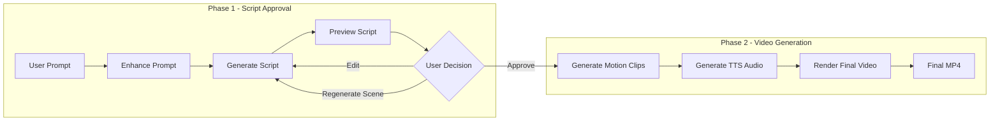
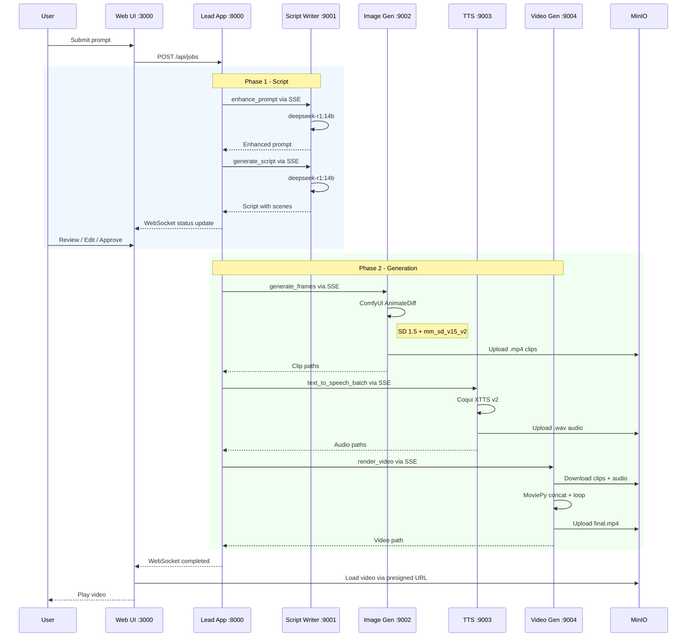
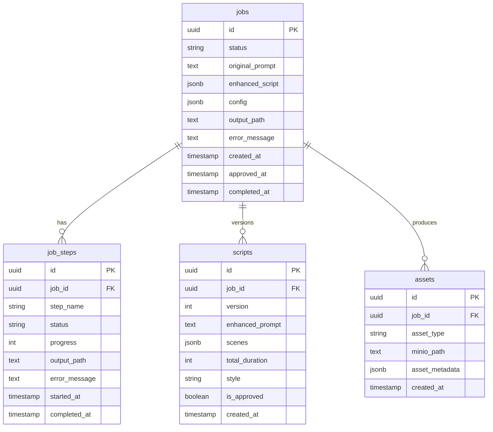
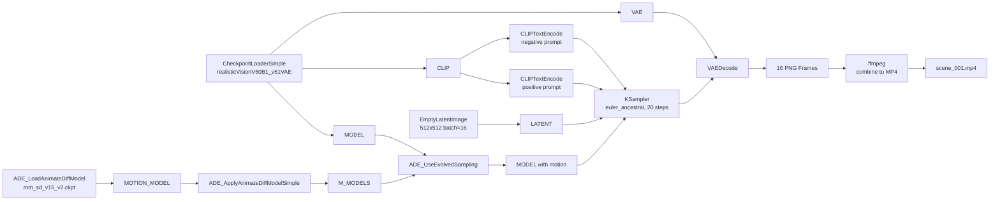

# Video Creation App - Project Plan

## Overview

Modular AI video creation system using local models. The **main-app** (Lead App + Web UI) orchestrates 4 independent **HTTP MCP servers** for script writing, motion video generation (AnimateDiff), text-to-speech, and video rendering. Features a **two-phase workflow**: script approval before resource-intensive generation.

---

## Tech Stack

| Component | Technology | Model / Engine |
|-----------|------------|----------------|
| Lead App | Python, FastAPI | - |
| Web UI | React, TypeScript, Vite, TailwindCSS | - |
| Script Writer | Ollama LLM | `deepseek-r1:14b` |
| Image/Video Gen | ComfyUI + AnimateDiff | SD 1.5 (`realisticVisionV60B1_v51VAE`) + `mm_sd_v15_v2` |
| TTS | Coqui XTTS v2 | `tts_models/multilingual/multi-dataset/xtts_v2` |
| Video Render | FFmpeg + MoviePy | libx264 / AAC |
| Database | PostgreSQL | - |
| Queue | Redis | - |
| Storage | MinIO (S3-compatible) | - |
| Communication | MCP Protocol over HTTP SSE | - |

---

## Models & Checkpoints

| Purpose | Model | Location | Size |
|---------|-------|----------|------|
| Script Generation | `deepseek-r1:14b` | Ollama (local) | ~8GB |
| Base Image Model (SD 1.5) | `realisticVisionV60B1_v51VAE.safetensors` | `ComfyUI/models/checkpoints/` | ~2GB |
| Motion Module (AnimateDiff) | `mm_sd_v15_v2.ckpt` | `ComfyUI/models/animatediff_models/` | ~1.8GB |
| Motion Module (v1.4, backup) | `mm_sd_v14.ckpt` | `ComfyUI/models/animatediff_models/` | ~1.6GB |
| SDXL (legacy static images) | `sd_xl_base_1.0.safetensors` | `ComfyUI/models/checkpoints/` | ~6.9GB |
| Text-to-Speech | Coqui XTTS v2 | Auto-downloaded by TTS lib | ~1.8GB |

---

## Project Structure

```
ollama-video-creation/
├── main-app/                       # Self-contained (no shared/ dependency)
│   ├── lead-app/                   # FastAPI orchestrator (:8000)
│   │   ├── .env                    # DB, Redis, MinIO, MCP URLs
│   │   ├── main.py
│   │   ├── requirements.txt
│   │   └── src/
│   │       ├── api/                # REST + WebSocket routes
│   │       ├── lib/                # Internal config, minio, logger
│   │       ├── mcp/                # MCP SSE client
│   │       ├── models/             # SQLAlchemy ORM
│   │       ├── services/           # Workflow, job service
│   │       └── config/             # Config re-export
│   │
│   └── web-ui/                     # React frontend (:3000)
│       ├── package.json
│       ├── vite.config.ts
│       └── src/
│           ├── api/                # Axios client
│           ├── components/         # UI components
│           ├── hooks/              # WebSocket hook
│           ├── pages/              # HomePage
│           └── store/              # Zustand state
│
├── apps/                           # MCP HTTP Servers (use shared/)
│   ├── mcp-script-writer/          # :9001
│   │   ├── .env
│   │   ├── requirements.txt
│   │   └── src/
│   │       ├── server.py           # SSE server
│   │       ├── tools/              # enhance_prompt, generate_script
│   │       └── llm_client/         # Ollama client
│   │
│   ├── mcp-image-gen/              # :9002
│   │   ├── .env
│   │   ├── requirements.txt
│   │   └── src/
│   │       ├── server.py           # SSE server
│   │       ├── tools/              # generate_frames, generate_video_clip
│   │       └── comfyui/            # ComfyUI API client
│   │
│   ├── mcp-tts/                    # :9003
│   │   ├── .env
│   │   ├── requirements.txt
│   │   └── src/
│   │       ├── server.py           # SSE server
│   │       ├── tools/              # text_to_speech, text_to_speech_batch
│   │       └── tts/                # Coqui XTTS client
│   │
│   └── mcp-video-gen/              # :9004
│       ├── .env
│       ├── requirements.txt
│       └── src/
│           ├── server.py           # SSE server
│           ├── tools/              # render_video, add_subtitles
│           └── render/             # MoviePy renderer
│
├── shared/                         # Shared Python utils (apps/ only)
│   ├── python/
│   │   ├── config.py               # Reads root .env
│   │   ├── minio_client.py
│   │   └── logger.py
│   └── types/                      # TypeScript types
│
├── ComfyUI/                        # ComfyUI installation
│   ├── models/
│   │   ├── checkpoints/            # SD 1.5, SDXL checkpoints
│   │   └── animatediff_models/     # Motion modules
│   └── custom_nodes/
│       ├── ComfyUI-AnimateDiff-Evolved/
│       └── ComfyUI-VideoHelperSuite/
│
├── scripts/
│   ├── start-all.sh                # Start all 6 services
│   └── setup.sh                    # Install all dependencies
│
├── .env                            # Root config (for shared/ / apps/)
└── PLAN.md
```

---

## Service Ports

| Service | Port | Type |
|---------|------|------|
| MCP Script Writer | 9001 | HTTP SSE |
| MCP Image Gen | 9002 | HTTP SSE |
| MCP TTS | 9003 | HTTP SSE |
| MCP Video Gen | 9004 | HTTP SSE |
| Lead App API | 8000 | HTTP REST + WebSocket |
| Web UI (Vite dev) | 3000 | HTTP |
| ComfyUI | 8188 | HTTP + WebSocket |
| Ollama | 11434 | HTTP |
| MinIO | 9000 | HTTP (S3) |
| PostgreSQL | 5432 | TCP |
| Redis | 6379 | TCP |

---

## Two-Phase Workflow



---

## Data Flow



---

## Database Schema



**Job Status Flow:**
```
draft -> script_pending -> script_ready -> approved -> processing -> completed
              ^                  |                                      |
              +------ edit ------+               failed <----- any step
```

**Step Names:** `clip_generation`, `tts_generation`, `video_rendering`

**Asset Types:** `clip` (MP4), `audio` (WAV), `video` (MP4)

---

## MCP Tools Reference

### mcp-script-writer (:9001)

| Tool | Input | Output | Model |
|------|-------|--------|-------|
| `enhance_prompt` | user_prompt | enhanced_prompt, style, suggested_duration | deepseek-r1:14b |
| `generate_script` | enhanced_prompt, style, duration | scenes[], total_duration | deepseek-r1:14b |
| `regenerate_scene` | scene_id, overall_concept, style, feedback | Updated scene object | deepseek-r1:14b |

### mcp-image-gen (:9002)

| Tool | Input | Output | Model |
|------|-------|--------|-------|
| `generate_frames` | scenes[], job_id, width, height, style, num_frames, fps | clips[] with MinIO paths | SD 1.5 + AnimateDiff mm_sd_v15_v2 |
| `generate_video_clip` | prompt, job_id, scene_id, width, height, num_frames, fps | Single clip MinIO path | SD 1.5 + AnimateDiff mm_sd_v15_v2 |
| `generate_image` | prompt, job_id, scene_id, width, height, style | Image MinIO path (legacy SDXL) | SDXL 1.0 |

### mcp-tts (:9003)

| Tool | Input | Output | Model |
|------|-------|--------|-------|
| `text_to_speech_batch` | scenes[], job_id, voice, language | audio_segments[] with MinIO paths | Coqui XTTS v2 |
| `text_to_speech` | text, job_id, scene_id, voice, language | Single audio MinIO path | Coqui XTTS v2 |
| `list_voices` | - | Available speakers | - |

### mcp-video-gen (:9004)

| Tool | Input | Output | Model |
|------|-------|--------|-------|
| `render_video` | job_id, frames[], fps, add_transitions | Final video MinIO path | FFmpeg + MoviePy |
| `add_subtitles` | job_id, video_path, subtitles[] | Subtitled video MinIO path | FFmpeg + MoviePy |

---

## AnimateDiff Pipeline (ComfyUI)



---

## Prerequisites

**System-level installations:**
- Python 3.11+
- Node.js 18+
- FFmpeg
- PostgreSQL
- Redis
- MinIO
- Ollama (with `deepseek-r1:14b`)
- ComfyUI (with AnimateDiff-Evolved + VideoHelperSuite)

---

## Quick Start

```bash
# 1. Setup all dependencies
./scripts/setup.sh

# 2. Ensure infrastructure is running
# PostgreSQL, Redis, MinIO, Ollama, ComfyUI

# 3. Start all 6 services
./scripts/start-all.sh

# 4. Open UI
open http://localhost:3000
```
